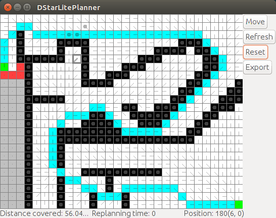

# PathFinder

This java application demonstrates path planning algorithms.

## Packages

This project's java code is split up into packages. Each package has a well-defined function.
(Unfortunately there is somewhat tight coupling between the packages,
so they can't be used independently without some modification.)

*  `graph`: Contains classes for representing graphs.
*  `planner`: Contains classes which represent path planning algorithms.
*  `robot`: Contains classes which represent an agent which has a local copy of a map,
    an actuator to move about, and a sensor to detect changes in surroundings.
*  `gridpanel`: `gridpanel.GridPanel` is a class which extends `JPanel`
    and can be used to draw GUI grids.
*  `driver`: Driver modules which are supposed to be run by the end user.
*  `util`: Utilities.

There's also a directory named `sample_input`, which contains input files which can be fed to
the application.

## How to build

This java project doesn't have any dependencies except [Apache ant](http://ant.apache.org/).
If you don't have `ant`, you can:

* install it via `sudo apt-get install ant` if you are on a Debian-based operating system.
* install it by following instructions on
  [Apache ant's website](http://ant.apache.org/manual/install.html#getting).

Once you have `ant`, run `ant build` in the project's root directory.

If you don't want to install `ant`, you can view `build.xml` and write appropriate
`javac` commands yourself.

## Documentation

Run `ant doc` to generate documentation in `doc/`.

## How to run

To run a text-based application, you can run:

    java driver.CliDriver sample_input/Graph.txt

Read `driver/CliDriver.java` to see which commands are supported.

To run a GUI application, you can run:

    java driver.GuiDriver sample_input/GridGraph3.txt DijkstraPlanner 2 2

It should be intuitive how to use this application, but if you have any problems,
please refer to `driver/GuiDriver.java` and inform me about it.
